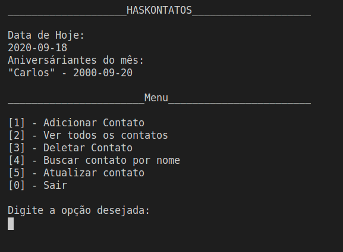
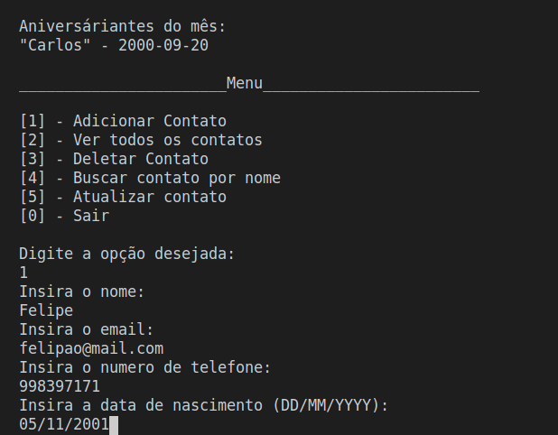

# Haskontatos

**Disciplina**: FGA0210 - PARADIGMAS DE PROGRAMAÇÃO - T01 <br>
**Nro do Grupo**: 02<br>
**Paradigma**: Funcional<br>

## Alunos
|Matrícula | Aluno |
| -- | -- |
| 16/0124581  | Hugo Aragão de Oliveira |
| 16/0123186  | Guilherme Guy de Andrade |
| 16/0121612  | Gabriela Barrozo Guedes |
| 15/0135521  | Leonardo dos S. S. Barreiros |


## Sobre

<p align="justify">O software Haskontatos é um programa de agenda de contatos escrito em Haskell, criado para evoluir os conhecimentos na linguagem e também no paradigma de programação funcional. Nele é possível cadastrar contatos (nome, email, telefone e data de aniversário), os contatos são persistidos em um arquivo. A agenda possui funcionalidades de criar, ler, editar e remover contatos, buscar contatos por uma substring do nome, mostrar os aniversariantes do mês e salvar a lista de contatos criada em arquivo.

## Screenshots





## Instalação e Execução
**Linguagens**: Haskell<br>

<p align="justify">Para rodar o projeto é necessário ter o GHC instalado.

<p align="justify">É necessário instalar as dependencias pelo cabal:

## Primeira opção

<hr>

rode o seguinte comando via terminial

```sh
cabal configure && cabal build && cabal install

```
<p align="justify">este comando irá utilizar do arquivo __haskontatos.cabal__ para realizar a instalação das dependências.

```sh

cabal install email-validate
cabal install bytestring
cabal install utf8-string
```
## Alternativas
<hr>

<p align="justify">O projeto possui um Makefile para auxiliar na compilação e execução do código. Siga os passos abaixo para executar a aplicação:

```sh
make build && make run
```

ou

```sh
make all
```

__Caso não consiga instalar as dependências__

Para quem é usuário Linux rode os seguintes comandos

__OBS__: Para os outros sistemas operacionais rodar o arquivo __haskontatos.cabal__ irá resolver as instalações.

```sh
cabal install --force--reinstalls email-validate
cabal install --force--reinstalls bytestring
cabal install --force--reinstalls utf8-string
```
<p align="justify">Esta solução irá forçar a instalação das dependencias que são necessarias para poder rodar o projeto.

## Uso

<hr>

<p align="justify">Ao iniciar o programa, caso já exista uma lista de contatos ela será carregada, em seguida o usuário verá uma tela de Menu com as opções:

```
[1] - Adicionar Contato
[2] - Ver todos os contatos
[3] - Deletar Contato
[4] - Buscar contato por nome
[5] - Atualizar contato
[0] - Sair
```

<p align="justify">O usuário deve selecionar a opção desejada e seguir as intruções do programa. Ao selecionar a opção de sair, será oferecido para salvar a lista de contatos.

## Vídeo

<hr>

Clique na imagem abaixo para ver o vídeo do programa funcionando:

[](https://youtu.be/ggt-cIWazMM)

<!-- ## Outros
Quaisquer outras informações sobre seu projeto podem ser descritas a seguir. -->

## Fontes

<hr>

[email-validate](https://hackage.haskell.org/package/email-validate)
[bytestring](https://hackage.haskell.org/package/bytestring)
[utf8-string](https://hackage.haskell.org/package/utf8-string)